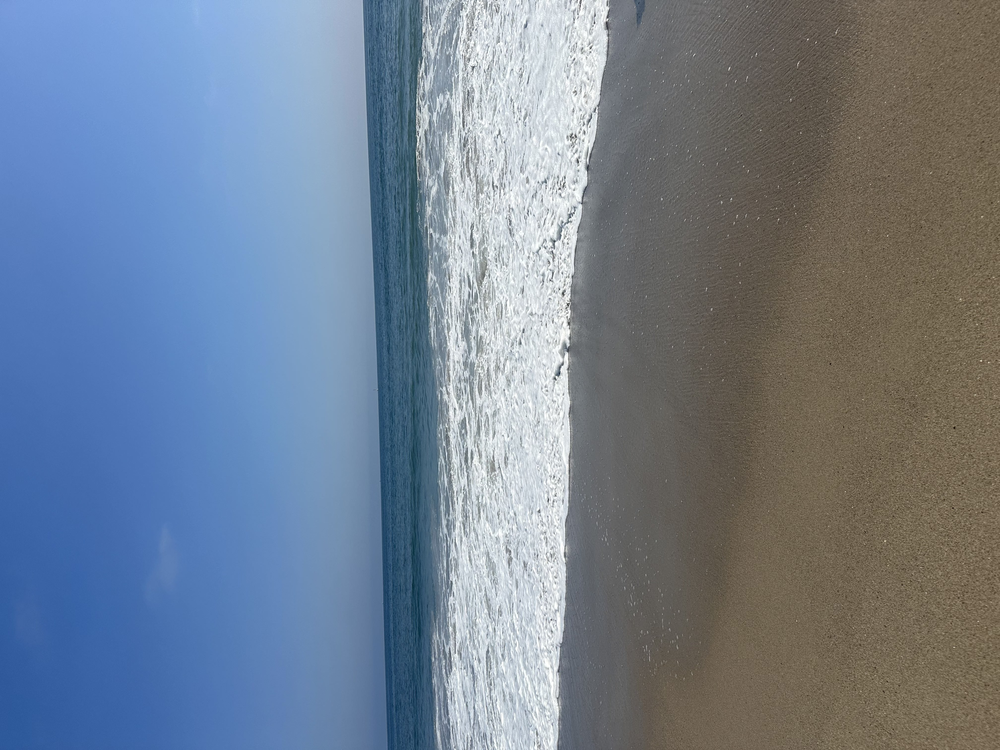

# my-summer-in-markdown
## Introduction
My name is **Jannat Afridi** and I am in 12th grade. I have two younger brothers, one is a sophomore and the other is in 4th grade. I love spedning time with my mom, we do everything together. I enjoy hiking, eating, and watching shows on Netflix. 

## Summer Activities
Over the summer, I did not really do much. I just wanted to relax after a hectic junior year. I went to the beach, multiples times, with my family. We also went camping at Kern River. I reconnected with some of my friends from elementary school and we went shopping at the mall. Other than that, my summer was pretty uneventful.

## Volunteer Work or Community Service
I am currently a volunteer at Valley Presbyterian Hospital. I started in June and I am still working there afterschool. It is a pretty rewarding job. Helping around and just being of service feels really great. Plus, I get to see what the healthcare field is like. 
## Fun Facts About Me
1. My favorite drink is a matcha latte (i quit coffee)
2.  I love burgers 
3. My favorite movie is Ratatouille
4. My birthday is on Halloween

## Goals for the School Year
I have a couple of goals I want to reach this school year
1. Pass my AP exams
2. All A's
3. Make memories with my friends
4. Get into my dream school (UCLA)

